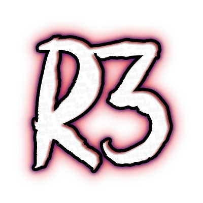
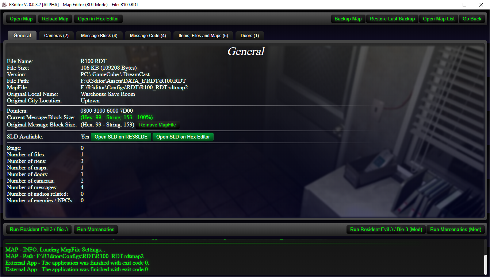

# Important
This project was put on hold due development on R3ditor V2.
Click <a href="https://themitosan.github.io/" target="_blank" title="Click here to visit TheMitoSan's site.">here</a> to know more.

<h1 align="center">
    
     R3ditor 
    
</h1>

R3ditor (it reads REditor) is a editor written in JS / NW.js <i>(aka. Node-Webkit)</i> capable of editing some Resident Evil 3 Classic files. 

## How to install
- Download NW.js (Node-Webkit) V. 0.37.4 and extract it into a folder of your choice! (Click <a href="https://dl.nwjs.io/v0.37.4/nwjs-sdk-v0.37.4-win-x64.zip" target="_blank">here</a> to download)

- Download the main content from this repository and extract all files in the same folder as you extracted NW.js (the `package.json` file must be in the same folder as the `nw.exe` executable).
- Open `R3ditor.exe (64)`.

<i>(If you have a 32-Bit system, you can use <a href="https://dl.nwjs.io/v0.37.4/nwjs-sdk-v0.37.4-win-ia32.zip" target="_blank">this version of NW.js</a>. In the end, run `R3ditor.exe (32)` instead of `R3ditor.exe (64)`)</i>

## Requirements
- OS: Windows 7 or higher
- To run the inicial setup you will need the Visual Studio 2005 installed (`rofs.exe` need this to unpack `Rofsxx.dat` files)

## How to update
- Just click on "Check for updates" and follow the instructions!

## Roadmap
As you can see, this software is in alpha stage. 
This software will receive less updates, since the efforts are being applied on R3ditor V2.

## Supported File Formats

### Bu00.sav (Saves)
You can change various aspects of your save, such as:

- HP
- Change IGT
- Change Inventories
- Change chests
- Current Character
- Current Outfit
- Poisoning Status
- Sidepack (Jill and Carlos)
- Current Weapon
- Difficulty
- Quantity of Saves
- Unlocked Epilogues

### Message Files (.MSG)
You can view / edit the game's internal messages by loading .msg files or using the "Hex Input" field. 
<i>Note that you need to use a hex editor or extract the files using <a href="https://www.romhacking.net/utilities/1019/" target="_blank">BioFAT</a> to extract the messages.</i>

### Room Data Table (.RDT)
You can edit messages, doors, which item is in the room, change its position and its animation. [WIP] 
Expect compatibility improvements and more features in the future!

### ARD Map File (.ARD)
For now this type of file cannot be fully recognized. Keep in mind that R3ditor is a long way from being able to change this type of file.

### Configuration File (.INI)
You can create a new config. file, edit your screen resolution, use an experimental resolution scaler and more. [WIP] 
Expect compatibility improvements and more features in the future!

## Other Features
R3ditor also can do:

- Read XYZR pos. in game¹
- Edit inventory in game¹
- Edit HP in game¹ (infinite life and enable god mode)
- Write texts using RE3 font with File Generator (WIP)
- Extract all Rofs (.dat) files (Wizard)
- Edit items combinations
- Edit nemesis item drops
- Edit starting items³
- Extract RDT files from PS ARD files²
- Apply Xdelta patches
- Extract SCD from RDT Maps

<i>¹ - Only avaliable in x64 NW.js version</i> 
<i>² - You need extract PC version before extracting ARD files</i> 
<i>³ - You can't edit GameCube version due this info are not stored on main executable file!</i>

### Important
Any changes you make will automatically apply to your files.
If you want to recover your save, open the "backup" folder and select the file you want to recover.  
You can restore your RDT by using the "Restore Last Backup" button on "RDT Editor".

## Third-Party software used on this project

Engine:
- <a href="https://nwjs.io" target="_blank">NW.js (aka. Node-Webkit)</a> by <a href="https://twitter.com/nw_js" target="_blank">NW.js community</a>

External JS Plugins:
- <a href="https://jquery.com/" target="_blank">jQuery</a> by <a href="https://jquery.org/team/" target="_blank">The jQuery Foundation</a>
- <a href="https://jqueryui.com/" target="_blank">jQuery UI</a> by <a href="https://jquery.org/team/" target="_blank">The jQuery Foundation</a>

NW.js Plugins:
- <a target="_blank" href="https://discord.js.org/#/docs/rpc/master/general/welcome">RPC</a> by <a href="https://discord.js.org/#/" target="_blank">discord.js</a>
- <a href="https://github.com/Rob--/memoryjs" target="_blank">memoryjs</a> by <a href="https://github.com/Rob--" target="_blank">Rob--</a>
- <a href="https://github.com/jprichardson/node-fs-extra" target="_blank">fs-extra</a> by <a href="https://github.com/jprichardson" target="_blank"> jprichardson</a>

These files can be found in "App/tools/":
- <a href="http://xdelta.org/" target="_blank">xdelta.exe (Xdelta patcher)</a>
- <a href="https://www.libsdl.org/" target="_blank">SDL.dll (Required for rofs.exe)</a>
- <a href="https://www.7-zip.org/" target="_blank">7z.exe, 7-zip.dll, 7za.dll, 7zxa.dll and 7za.exe (7zip)</a>
- <a href="https://github.com/pmandin/reevengi-tools" target="_blank">rofs.exe (Reevengi-tools - Rofs Unpacker Compiled)</a>

## Credits:
I would like to thank everyone who helped me with this project - since without your help none of this would be possible!

Many thanks to:
 - discordjs - RPC - <a target="_blank" href="https://discord.js.org/#/docs/rpc/master/general/welcome">Website</a> 
 - Rob-- - memoryjs - <a target="_blank" href="https://github.com/Rob--/memoryjs">GitHub</a> 
 - MarkGrass - BIOFAT - <a target="_blank" href="https://www.romhacking.net/utilities/1019/">More Info</a> 
 - hongru - Canvas2Image - <a target="_blank" href="https://github.com/hongru/canvas2image">GitHub</a> 
 - pmandin - reevengi-tools - <a target="_blank" href="https://github.com/pmandin/reevengi-tools">GitHub</a> 
 - Joshua MacDonald - Xdelta - <a target="_blank" href="https://github.com/jmacd/xdelta">GitHub</a> 
 - jprichardson - fs-extra plugin - <a target="_blank" href="https://github.com/jprichardson/node-fs-extra">GitHub</a> 
 - Niklas von Hertzen - Html2Canvas - <a target="_blank" href="https://html2canvas.hertzen.com">More Info</a> 
 - The entire Resident Evil 1 2 3 Forum! - <a target="_blank" href="https://www.tapatalk.com/groups/residentevil123/">More Info</a> 
 - Leo2236 - RE3SLDE Software Creator - <a target="_blank" href="http://lgt.createaforum.com/">LGT Forum</a> 
 - Angus Johnson - Resource hacker - <a target="_blank" href="http://www.angusj.com/resourcehacker/">Official Website</a> 
 - The Mortican - BIO3GPS and Memory Address - <a target="_blank" href="https://www.tapatalk.com/groups/residentevil123/bio3gps-t1780.html">More Info</a> 
 - Khaled SA - RDT / ARD Header Infos - Beta-testing - <a target="_blank" href="https://twitter.com/khaleed681">Twitter</a> 
 - Klarth - TIM Graphic Formats (PSX 2D Graphics) - <a target="_blank" href="http://www.romhacking.net/documents/31/">More Info</a> 
 - "Shockproof" Jamo Koivisto - BIO 3 Hex Chest Modding - <a target="_blank" href="https://gamefaqs.gamespot.com/pc/431704-resident-evil-3-nemesis/faqs/36465">More Info</a> 
 - ResidentEvilArtist - Memory Positions, IEDIT Editor, MIX Editor and so much more! - <a target="_blank" href="https://www.tapatalk.com/groups/residentevil123/memberlist.php?mode=viewprofile&u=294">Tapatalk Profile</a> 
 - Biohazard España - Fix OBJ to RE3MV (OBJ Patcher), Beta-testing, SLUS / ARD info and even more! - <a target="_blank" href="https://twitter.com/biohazardEsp">Profile</a> 
 

<i>Important: Biohazard and Resident Evil are trademarks of ©CAPCOM CO., LTD. ALL RIGHTS RESERVED.</i>
